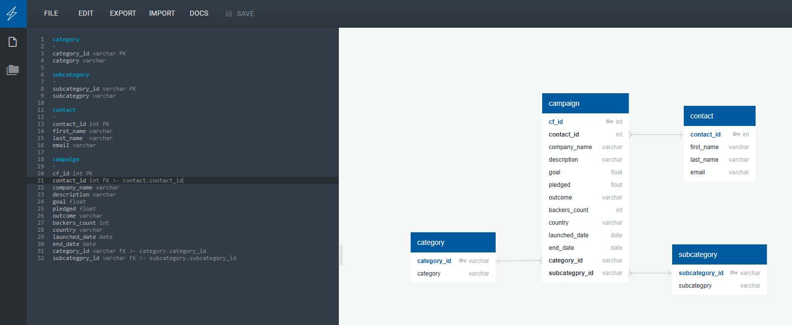
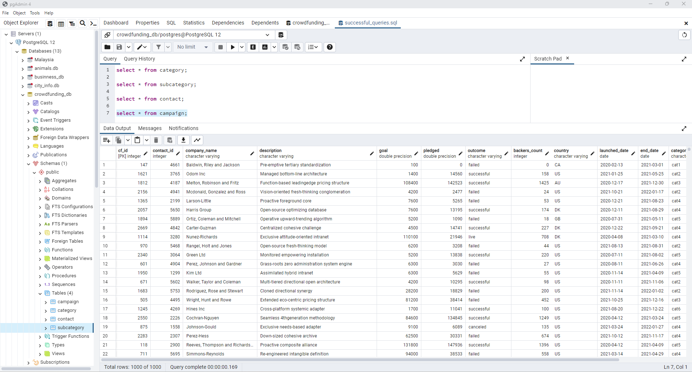

# Crowdfunding_ETL

In this project, we worked in a group to create an ETL pipeline using Python, Pandas, and both Python dictionary methods and regular expressions to extract and transform the data <ETL_Mini_Project_KYong.ipynb>.

After we transformed the data, we created four CSV files <campaign.csv>, <contact.csv>, <category.csv> and <subcategory.csv>, and use the CSV file data to create an ERD (see below) and a table schema <crowdfunding_db_schema.sql>.

Finally, we have uploaded the CSV file data into a Postgres database. 

We are able to successfully read the data uploaded with a few queries:

We collaborated and communicated regularly during the project. I also checked in with my group regularly and offered my support.